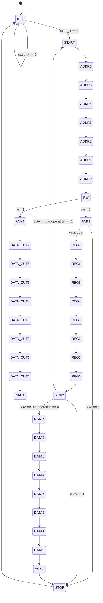

## I2C Master FSM

```mermaid
stateDiagram-v2

    [*] --> IDLE
    IDLE --> START  : start_tx == 1
    IDLE --> IDLE  : start_tx == 0
    
    START --> ADDR6
    ADDR6 --> ADDR5
    ADDR5 --> ADDR4
    ADDR4 --> ADDR3
    ADDR3 --> ADDR2
    ADDR2 --> ADDR1
    ADDR1 --> ADDR0
    ADDR0 --> RW
    RW --> ACK1    : rw = 0
    RW --> ACK4     : rw = 1
    ACK1 --> STOP   : SDA == 1
    ACK1 --> REG7   : SDA == 0
    STOP --> IDLE

    REG7 --> REG6
    REG6 --> REG5
    REG5 --> REG4
    REG4 --> REG3
    REG3 --> REG2
    REG2 --> REG1
    REG1 --> REG0
    REG0 --> ACK2

    ACK2 --> STOP : SDA == 1
    ACK2 --> DATA7: SDA == 0 & operation == 0
    ACK2 --> START: SDA == 0 & operation == 1

    DATA7 --> DATA6
    DATA6 --> DATA5
    DATA5 --> DATA4
    DATA4 --> DATA3
    DATA3 --> DATA2
    DATA2 --> DATA1
    DATA1 --> DATA0
    DATA0 --> ACK3
    ACK3 --> STOP 

    ACK4 --> DATA_OUT7
    DATA_OUT7 --> DATA_OUT6
    DATA_OUT6 --> DATA_OUT5
    DATA_OUT5 --> DATA_OUT4
    DATA_OUT4 --> DATA_OUT3
    DATA_OUT3 --> DATA_OUT2
    DATA_OUT2 --> DATA_OUT1
    DATA_OUT1 --> DATA_OUT0
    DATA_OUT0 --> NACK
    
    
```