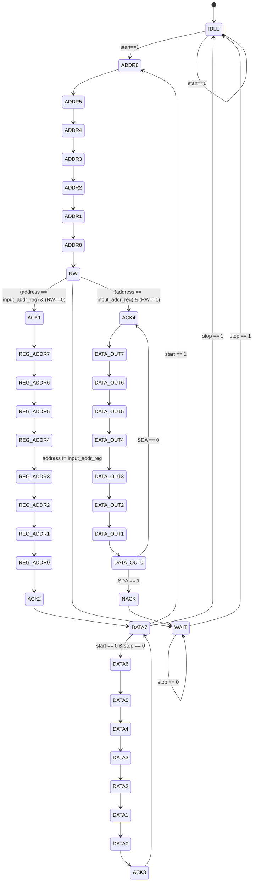

## Start Detector

Shifter starts to shift when SCL == 1. 

If data is Valid: shifter state will go through 0X -> XX.

For Start Signal:   shifter state will go through 01 -> 10 -> 00

For Stop Signal:    shifter state will go through 00 -> 01 -> 11

## I2C Slave FSM
